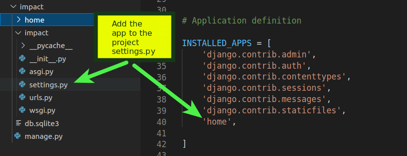
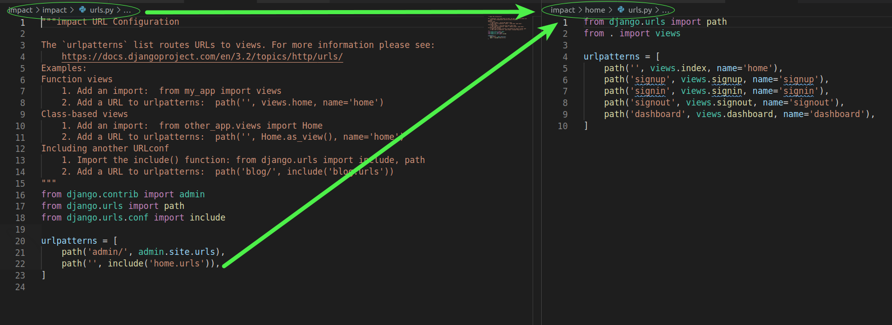
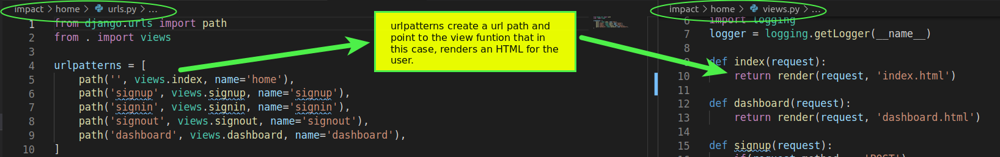
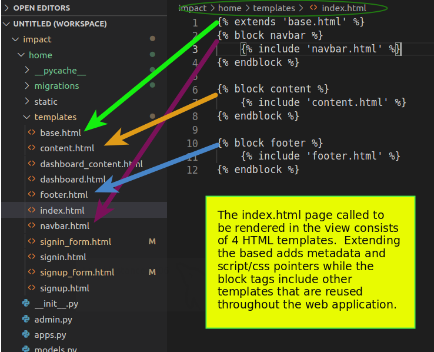
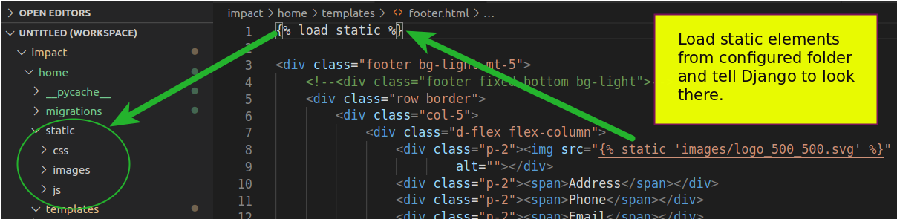
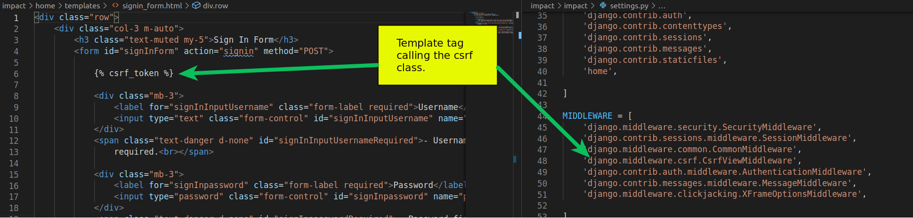

project_report

<h1 align="center"><strong>IFT 598 Project Report for Deliverable 4</strong></h1>

 A Project Report presented to the instructors of IFT 598 Middleware Programming and Database Security
 

By GROUP 28
 

<em>Hooman Mishaeil - Group 28</em>

<em>IFT 598 Session C, Summer 2021</em>

<em>hmishaei@asu.edu</em>
 

<em>Jeffrey Ashworth - Group 28</em>

<em>IFT 598 Session C, Summer 2021</em>

<em>jdashwo2@asu.edu </em>
 
  
- [**Introduction**](#introduction)
- [**Description**](#description)
- [**User Manual**](#user-manual)
- [**Conclusion**](#conclusion)

# **Introduction**
  To fulfill the requirements for deliverable 4, Group 28 used Django, a Model, View,  Controller framework to render the HTML files developed in deliverable 1.  The team installed Django framework in a python virtual environment, created new projects and apps and configured the files to the initial views and controllers, saving the models for a later deliverable.  During the process, the team had occasion to make some design revisions to take advantage of Django specific features adding a base template that was then extended to other templates to render the home.html, signin.html, and signup.html pages.  While there were some modifications to the original design, they improved the usability and reduced the amount of code required to implement the solution.
  

# **Description**
Django was installed in a newly created python virtual environment, separating the project into its own container, isolating components such as the Django framework from her projects, allowing multiple development efforts to occur at once.
After the Django installation, a new project called impact was created using the django-admin command line tool.  This command created the project structure and provided the manage.py command line tool in the root of the project where we could then use it to run the server, migrate models to the database and create apps.  A Django app is generally used as a containerized function of the web application and while there are many options on to organize apps, the team chose to create an app called 'home' to contain the initial landing page, sign in and sign up functions of the web application.  The app was then configured int he settings.py of the project. 

To map the URLs, the team chose a standard convention of providing an include function in the project urls.py and then created an app based urls.py to map to the views in the views.py.

Next the team created the view functions called out in the urls.py. The view functions will create HTML pages and return them to the user in the browser.  In a later deliverable the view functions will also get data from the requested model (models.py) to be included in the HTML pages.  For this deliverable, the views will render the HTML pages in the templates.

As mentioned in the introduction, the team chose to modify the original page design to take advantage of the available Django template tags.  The team broke out the original single page with the two modal forms into reusable components such as the navbar, footer, and script pointers.  By extending the base.htm page using the Django extends tag , the base.html is rendered and all of the { % include % } components are pointed to, rendering a complete HTML page to the user from several different templates.  Form templates were also created and the original modal forms were eliminated. 

To accommodate the static elements such as images, scripts, and CSS pages, a folder called static was created in the home app.  Django knows to look in this directory based on the STATIC_URL value in the project's settings.py.  A template tag { % load static % } was then applied to the HTML templates using static elements to load the static elements and the called elements were decorated with the { % static "static element" % }.  

Because Django is a "batteries included" framework, meaning it provides advanced functionality in an easy to implement, the team realized there are unsafe actions required for the forms the use the HTTP POST.  This action can be taken advantage of by adversaries using Cross Site Request Forgeries, injected JavaScript into the call to provide malicious code.  A private token is provided to the client as a part of the HTTP request that cannot be guessed by the adversary, making it nearly impossible for a malformed URL to be created.  As the team chose not to use Django Forms where the token is automatically created, as long as the MIDDLEWARE settings include the csrf class, a template tag { % csrf_token % } can be added in the form to provide this functionality.  

# **User Manual**
This user manual assumes the user already has a 3.8.x version of Python installed.  Create a new virtual environment is a directory of your choice using virtualenv or venv.  Your operating system commands and utilities may vary.  For example using venv on Ubuntu, python - venv "my_project" will create scaffolding and install the packages required for the "my_project" virtual environment.  Activate the environment in the directory created using source bin/activate. From here pip install Django.  Unzip the provided .zip package into the directory.  You will have root project directory called impact and two subdirectories called impact (the project directory) and home (the app directory.).  In a terminal, navigate to the impact/impact directory.  In this directory execute "python manage.py runserver".  Django will use the provided project configurations to properly run the project. This will start the Django development server listening on port 8000.  You can then open a browser and enter a URL of 127.0.0.1:8000 to access the IMPACT Django web application home page.
# **Conclusion**
In this deliverable, Group 28 expanded their HTML page into a Model, View, Controller based web application by including the Django Framework and it's functionality.  While the models (data) are yet to come, the team installed Django, configured the URL routes to point to view functions that used HTML templates to return HTML content to a browser.  The team learned that built in Django functionality such as templates and template tags could greatly reduce the amount of code required for each view rendered HTML page and provide a high level of reusability.  The team was challenged by changing the design from a single HTML page with modal forms to multiple HTML templates while still retaining the validation functionality.  It was determined the default behavior of the button was to reload the page and thus, the validations were reset almost instantly.  The solution was to override the default button behavior.  The team continues to improve and will adjust the level of detail assumed in future deliverables.